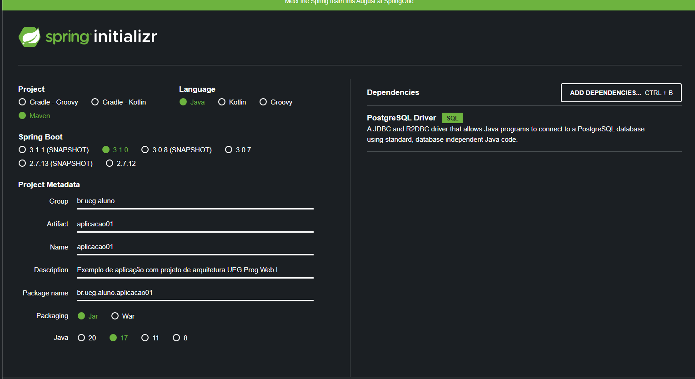

# Preapar projeto de arquitetura para utilizar.

* Basta executar o comando:
  * ```mvn clean install```

# Criação de um projeto Utilizando Arquitetura - UEG Programação WEB I

* Criar um projeto utilizando o https://start.spring.io/
  * **Project:** Maven
  * **Language:** Java
  * **Spring Boot:** 3.1.0 (última versão estável) a versão 2.7 não funcionara
  * **Project Metadata:** Preencha conforme desejar
    * **Java:** 17
  * **Depedencies:** Adicione o drive do banco que irá utilizar: ex.: PostgreSQL Driver
  * 
* Criar o Pacote **configuration**
  * criar a classe SwaggerConfig conforme abaixo:
    ```
    @Configuration
    public class SwaggerConfig extends ApiSwaggerConfig {
    }
    ```
  * criar a classe **WebConfig**
    ```
    @Configuration
    public class WebConfig extends ApiWebConfig {
    }
    ```
* Criar o Pacote **exception**
  * criar a classe **ResponseExceptionHandler**
    ```
    @ControllerAdvice
     public class ResponseExceptionHandler extends ApiRestResponseExceptionHandler {
    }
    ```
* criar a enum **SistemaMessageCode**
  ```
  public enum SistemaMessageCode implements MessageCode {
    ERRO_CAMPOS_OBRIGATORIOS("MSG-001", 400),
    MSG_OPERACAO_REALIZADA_SUCESSO("MSG-002", 200);

    private final String code;
    private final Integer status;
    SistemaMessageCode(final String code, final Integer status) {
      this.code = code;
      this.status = status;
    }
    public String getCode() { return code; }
    public Integer getStatus() { return status; }
    @Override
    public String toString() { return code; }
  }
  ```
* Alerar a anotação _SpringBootApplication_ da classe **Application** conforme abaixo:
  ```
  @SpringBootApplication(scanBasePackages = {
    "br.ueg.aluno.aplicacao01.*", // modificar conforme o pacote padrão do seu projeto
    "br.ueg.prog.webi.*" //Para funcionamento da Arquitetura
  })
  @EntityScan(basePackageClasses = { Jsr310JpaConverters.class },
  basePackages = {
   "br.ueg.aluno.aplicacao01.*", //modificar conforme o pacote padrão do seu projeto
   "br.ueg.prog.webi.api.*" //Para funcionamento da Arquitetura
  })
  ```
* Ajustar o arquivo _src/main/resources/application.properties_
  ```
  springdoc.version=v1
  app.api.version=v1
  app.api.base=/api/${app.api.version}
  #Ajustar o título abaixo conforme o projeto
  app.api.swagger.title=Faculdade Somos todos Nós API
  app.api.swagger.base-package=br.ueg.aluno.aplicacao01
  #configuração para pegar mensagens do projeto primeiro depois da arquitetura
  spring.messages.basename=messages,messages-arquitetura

  #configurações conforme o seu projeto
  spring.datasource.url=jdbc:postgresql://localhost:5433/faculdade
  spring.datasource.username=postgres
  spring.datasource.password=postgres
  spring.jpa.hibernate.ddl-auto=create-drop
  spring.jpa.properties.hibernate.dialect=org.hibernate.dialect.PostgreSQLDialect

  #Configurações apenas para desenvolvimento
  #para mostrar SQL
  spring.jpa.properties.hibernate.format_sql=true
  #para mostrar os parametros da sql
  logging.level.org.hibernate.SQL=debug
  logging.level.org.hibernate.orm.jdbc.bind=trace
  server.error.include-message=always
  server.error.include-stacktrace=never
  ```
* Copie o _pom.xml_ abaixo para o pom.xml do seu projeot e altere os detalhes do projeto
  ```
  <?xml version="1.0" encoding="UTF-8"?>
  <project xmlns="http://maven.apache.org/POM/4.0.0" xmlns:xsi="http://www.w3.org/2001/XMLSchema-instance"
    xsi:schemaLocation="http://maven.apache.org/POM/4.0.0 https://maven.apache.org/xsd/maven-4.0.0.xsd">
    <modelVersion>4.0.0</modelVersion>
    <parent>
      <groupId>org.springframework.boot</groupId>
      <artifactId>spring-boot-starter-parent</artifactId>
      <version>3.0.4</version>
      <relativePath/> <!-- lookup parent from repository -->
    </parent>
    <groupId>br.ueg.aluno</groupId>
    <artifactId>aplicacao01</artifactId>
    <version>0.0.1-SNAPSHOT</version>
    <name>aplicacao01</name>
    <description>Exemplo de aplicação com projeto de arquitetura UEG Prog Web I</description>
    <properties>
      <java.version>17</java.version>
      <lombok.version>1.18.26</lombok.version>
      <mapstruct.version>1.5.3.Final</mapstruct.version>
      <lombok-mapstruct-binding.version>0.2.0</lombok-mapstruct-binding.version>
    </properties>
    <dependencies>
      <dependency>
        <groupId>org.springframework.boot</groupId>
        <artifactId>spring-boot-starter-data-jpa</artifactId>
      </dependency>
      <dependency>
        <groupId>org.springframework.boot</groupId>
        <artifactId>spring-boot-starter-web</artifactId>
      </dependency>
 
      <dependency>
        <groupId>org.springframework.boot</groupId>
        <artifactId>spring-boot-devtools</artifactId>
        <scope>runtime</scope>
        <optional>true</optional>
      </dependency>
      <dependency>
        <groupId>org.projectlombok</groupId>
        <artifactId>lombok</artifactId>
        <optional>true</optional>
      </dependency>
      <dependency>
        <groupId>org.springdoc</groupId>
        <artifactId>springdoc-openapi-starter-webmvc-ui</artifactId>
        <version>2.0.4</version>
      </dependency>
      <dependency>
        <groupId>org.springdoc</groupId>
        <artifactId>springdoc-openapi-ui</artifactId>
        <version>1.6.15</version>
      </dependency>
 
      <dependency>
        <groupId>org.mapstruct</groupId>
        <artifactId>mapstruct</artifactId>
        <version>1.5.3.Final</version>
      </dependency>
 
      <!-- Adicionadas dia 20/04/2023 !-->
      <!-- Mail -->
      <dependency>
        <groupId>com.sun.mail</groupId>
        <artifactId>javax.mail</artifactId>
        <version>1.6.2</version>
      </dependency>
 
      <dependency>
        <groupId>br.com.caelum.stella</groupId>
        <artifactId>caelum-stella-core</artifactId>
        <version>2.1.6</version>
      </dependency>
      <dependency>
        <groupId>jakarta.validation</groupId>
        <artifactId>jakarta.validation-api</artifactId>
        <version>3.0.2</version>
      </dependency>
 
      <dependency>
        <groupId>org.springframework.boot</groupId>
        <artifactId>spring-boot-starter-validation</artifactId>
      </dependency>
      <dependency>
        <groupId>org.apache.commons</groupId>
        <artifactId>commons-lang3</artifactId>
      </dependency>
 
      <dependency>
        <groupId>commons-collections</groupId>
        <artifactId>commons-collections</artifactId>
        <version>3.2.2</version>
      </dependency>
      <dependency>
        <groupId>br.ueg.prog.webi</groupId>
        <artifactId>aquitetura</artifactId>
        <version>0.0.1-SNAPSHOT</version>
        <scope>compile</scope>
      </dependency>
      <dependency>
          <groupId>org.postgresql</groupId>
          <artifactId>postgresql</artifactId>
          <scope>runtime</scope>
      </dependency>
    </dependencies>
    <build>
      <plugins>
        <plugin>
          <groupId>org.springframework.boot</groupId>
          <artifactId>spring-boot-maven-plugin</artifactId>
          <configuration>
            <excludes>
              <exclude>
                <groupId>org.projectlombok</groupId>
                <artifactId>lombok</artifactId>
              </exclude>
            </excludes>
          </configuration>
        </plugin>
        <plugin>
          <groupId>org.apache.maven.plugins</groupId>
          <artifactId>maven-compiler-plugin</artifactId>
          <version>3.8.1</version>
          <configuration>
            <source>17</source>
            <target>17</target>
            <annotationProcessorPaths>
              <path>
                <groupId>org.projectlombok</groupId>
                <artifactId>lombok</artifactId>
                <version>${lombok.version}</version>
              </path>
              <path>
                <groupId>org.mapstruct</groupId>
                <artifactId>mapstruct-processor</artifactId>
                <version>${mapstruct.version}</version>
              </path>
              <path>
                <groupId>org.projectlombok</groupId>
                <artifactId>lombok-mapstruct-binding</artifactId>
                <version>${lombok-mapstruct-binding.version}</version>
              </path>
            </annotationProcessorPaths>
          </configuration>
        </plugin>
      </plugins>
    </build>

  </project>
  ```
 * Uma versão exemplo de um projeto vazio pode ser baixado em:  
   https://github.com/GuilianoRangel/ueg-prog-webi-backend/tree/base-inicial
 * Uma versão com alguns casos de uso de exemplos pode ser baixada em:
   https://github.com/GuilianoRangel/ueg-prog-webi-backend/tree/exemplos-crud
